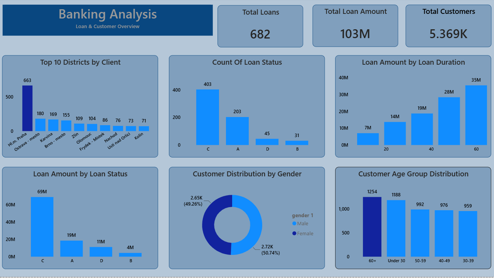
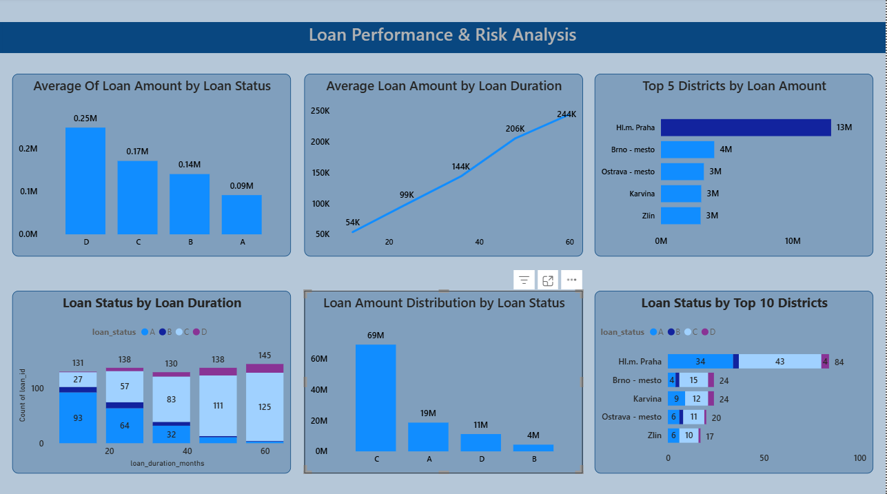
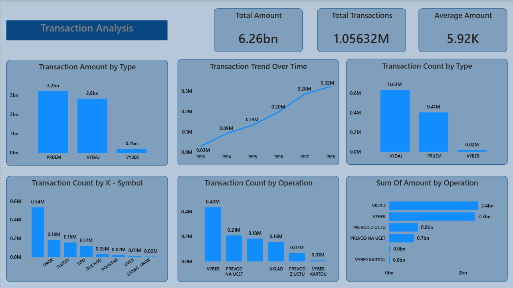

# Banking Customer Behaviour & Loan Risk Analysis
### Czech Bank (Berka) Dataset - SQL • Python • Power BI

An end-to-end data analytics project that examines customer behaviour, transaction activity, and loan repayment risk for a retail bank, using the classic **Berka Banking dataset**. The project combines **SQL-driven business analysis**, **Python (Pandas/Matplotlib) validation**, and an **interactive Power BI dashboard** to move from raw relational data to business recommendations.

---

## Project Objective

A bank generates large volumes of operational data across accounts, transactions, cards, standing orders, and loans - but individual records alone don't reveal *which customers are valuable*, *where credit risk is concentrated*, or *how borrowing behaviour differs across customer groups*.

This project brings those records together to:
- Understand how customers use their accounts and how transaction behaviour varies across the customer base
- Examine the loan portfolio to identify repayment patterns and where credit risk is concentrated
- Explore whether customer, account, transaction, and regional characteristics help explain loan outcomes
- Build and validate a simple **rule-based loan risk scoring model**

---

## Tech Stack

| Layer | Tool |
|---|---|
| Database | SQLite (relational schema built from the Berka CSVs) |
| Analysis | SQL (CTEs, window functions, aggregations) |
| Validation & EDA | Python - Pandas, Matplotlib |
| Visualization | Power BI (3-page interactive dashboard) |
| Environment | Jupyter Notebook |

---

## 🗂️ Repository Structure

- **notebooks/**
  - `01_berka_banking_analysis.ipynb` — Full SQL + Python analysis
- **sql/**
  - `berka_bank.db` — SQLite database (8 relational tables)
- **powerbi/**
  - `Banking_Loan_Risk_Dashboard.pbix` — 3-page interactive Power BI report
- **images/**
  - Dashboard screenshots
- `README.md`

---

## Dataset Overview

The Berka Banking dataset consists of **8 relational tables**:

| Table | Description | Rows |
|---|---|---|
| `account` | Account creation details, district, statement frequency | 4,500 |
| `client` | Customer demographics (birth number, gender, district) | 5,369 |
| `disp` | Maps clients to accounts (owner/disponent) | 5,369 |
| `loan` | Loan amount, duration, payments, repayment status | 682 |
| `trans` | Full transaction history | 1,056,320 |
| `order` | Standing orders / scheduled payments | 6,471 |
| `card` | Bank card information | 892 |
| `district` | Regional demographic & economic indicators | 77 |

**Data quality:** identifier checks returned zero duplicates across all 8 tables. The `trans` table was the only table with missing values (`operation`, `k_symbol`, `bank`, `account`) — investigated and confirmed to be **contextual** (e.g. cash withdrawals legitimately have no destination bank/account), so these were retained as-is rather than imputed or dropped.

---

## 🔁 Project Workflow

1. Berka Banking Dataset (CSV)
2. SQLite Database Setup
3. Data Validation & Preparation *(dates, categorical labels, district columns)*
4. SQL Business Analysis *(Customer, Loan, Transaction & Risk)*
5. Python EDA *(charts & visual validation of SQL results)*
6. Rule-Based Loan Risk Scoring Model + Validation
7. Power BI Dashboard *(interactive business-facing view)*
8. Business Insights & Recommendations

---

## Data Preparation

Before analysis, the following cleanup was applied (details in the notebook, Section 4):
- **Dates** converted from compact `YYMMDD` integers into standard `YYYY-MM-DD` format across `account`, `card`, `loan`, and `trans`
- **Categorical codes** translated from the original Czech source labels into clear English labels (kept alongside the original values for traceability) - e.g. loan `status` codes, account `frequency`, transaction `type`/`operation`
- **District columns** renamed from generic `A1`–`A16` codes to meaningful names (district name, region, inhabitants, unemployment rate, etc.) using the official dataset documentation

---

## Key Analysis Areas (SQL)

1. **Customer Base Overview** - geographic concentration of customers by district
2. **Customer Demographic Profile** - age and gender distribution
3. **Account Usage Pattern** - statement frequency distribution
4. **Transaction Activity Pattern** - transaction count vs. total value by account
5. **Money Inflow vs Outflow** - direction and value of money movement
6. **Loan Portfolio Concentration** - where lending value is concentrated
7. **Loan Status Distribution** - performing vs. at-risk loans
8. **Loan Amount vs Repayment Status** - risk by loan size
9. **District-wise Loan Risk** - regional repayment performance
10. **Transaction Behaviour vs Loan Repayment** - does account activity predict risk?
11. **High-Risk Customer Prioritization** - customers combining large loans + repayment problems
12. **Loan Risk Scoring Model** - rule-based Low/Medium/High risk classification, validated against actual repayment outcomes

Each SQL section in the notebook follows a **Business Context → Business Question → Result → Observation → Interpretation → Business Implication** structure, and every finding is re-validated visually in the Python EDA section (6.1–6.6).

---

## Power BI Dashboard

The Power BI report has **3 pages**, built directly on the same SQLite tables used in the notebook:

### Page 1 - Banking Analysis (Loan & Customer Overview)



KPIs: 682 total loans · 103M total loan amount · 5,369 total customers
Visuals: Top 10 Districts by Client, Loan Status Count, Loan Amount by Duration, Loan Amount by Status, Customer Gender Split, Customer Age Group Distribution

### Page 2 - Loan Performance & Risk Analysis



Visuals: Average Loan Amount by Status, Average Loan Amount by Duration, Top 5 Districts by Loan Amount, Loan Status by Duration, Loan Amount Distribution by Status, Loan Status by Top 10 Districts

### Page 3 - Transaction Analysis



KPIs: 6.26bn total transaction amount · 1.05632M total transactions · 5.92K average amount
Visuals: Transaction Amount/Count by Type, Transaction Trend Over Time (1993–1998), Transaction Count by K-Symbol, Transaction Count & Sum by Operation

 **Cross-check with the notebook:** total loans (682), total customers (5,369/5.369K), total loan amount (103M), loan status counts (C:403, A:203, D:45, B:31), gender split (Male 2,724 / Female 2,645), age group distribution, top-10 district ranking, district-level loan status breakdown, and the transaction figures (PRIJEM 3.2bn ≈ notebook Inflow 3.227bn; VYDAJ+VYBER 2.8bn+0.2bn=3.0bn ≈ notebook Outflow 3.030bn; total ≈ 6.26bn) all reconcile cleanly between the SQL/Python analysis and the Power BI visuals.

---

## A Note on Labels & Language

The **raw Berka dataset is in Czech**, and this shows up differently across the two deliverables:

- **Notebook (SQL/Python):** categorical codes were explicitly translated into English business labels — e.g. loan status `A/B/C/D` → *"Contract finished – no problems"*, *"Running contract – client in debt"*, etc.; transaction `operation` codes like `VKLAD`, `VYBER`, `PREVOD NA UCET` → *"Cash deposit"*, *"Cash withdrawal"*, *"Remittance to another bank"*; account `frequency` codes → *"Monthly issuance"*, etc. The original Czech values were always kept alongside the English label for traceability.
- **Power BI dashboard:** several visuals (loan status legend, transaction `operation`/`k_symbol` charts) still show the **raw Czech/coded values** (`A`, `B`, `C`, `D`, `VYBER`, `UROK`, `SIPO`, `DUCHOD`, `SLUZBY`, `POJISTNE`, `UVER`, `SANKC. UROK`, etc.) because those visuals were built directly on the source tables before the labeling step was applied in the notebook.

**Recommendation before publishing:** add a small mapping table (or a Power BI calculated column using the same `CASE WHEN` logic from notebook Section 4.2) so the dashboard's legends match the notebook's English labels. A quick reference table:

| Code | English Meaning |
|---|---|
| Loan status `A` | Contract finished - no problems |
| Loan status `B` | Contract finished - loan not paid |
| Loan status `C` | Running contract - OK so far |
| Loan status `D` | Running contract - client in debt |
| `VKLAD` | Cash deposit |
| `VYBER` | Cash withdrawal |
| `VYBER KARTOU` | Credit card withdrawal |
| `PREVOD NA UCET` | Remittance to another bank |
| `PREVOD Z UCTU` | Collection from another bank |
| `UROK` | Interest credited |
| `SLUZBY` | Payment for statement/service |
| `SIPO` | Household payment |
| `DUCHOD` | Old-age pension |
| `POJISTNE` | Insurance payment |
| `UVER` | Loan payment |
| `SANKC. UROK` | Sanction interest (negative balance penalty) |

---

## Final Key Findings

- The **60+ age group** is the largest customer segment (1,254 customers), followed by **Under 30** (1,188) - the bank serves a broad, evenly-spread age base rather than one dominant group
- Lending is concentrated in the **Below 100K** loan segment by volume (305 loans), but the **200K+** segment carries the largest share of total lending *value*
- **59%** of loans are actively running with no issues; only **~11%** of loans fall into debt or non-repayment categories - a healthy overall portfolio
- Transaction activity does **not** reliably predict loan risk on its own — higher transaction counts mostly reflect account *tenure*, not repayment reliability
- Only **76 high-risk customers** (45 currently in debt + 31 unpaid-and-closed) were identified - a small but high-priority group
- A rule-based **risk scoring model** (loan amount + duration + district unemployment rate) correctly separates High Risk loans (15.35% actual default rate) from Medium (8.46%) and Low Risk (8.97%) loans, validating its use for early monitoring

---

## Business Recommendations

1. Introduce financial products tailored to the large 60+ customer segment while designing engagement campaigns for the under-30 segment
2. Maintain regular portfolio reviews for the high-volume **Below 100K** loan segment to catch early repayment shifts
3. Prioritize collection and early-intervention efforts on the 76 identified high-risk accounts, especially high-value loans already in debt
4. Integrate the rule-based risk score into the loan approval/monitoring workflow to flag High Risk accounts early
5. Track inflow/outflow trends and high-activity accounts periodically to support liquidity monitoring and cross-selling

---

## How to Reproduce

```bash
# clone the repo
git clone https://github.com/Saran-t00/Berka-Banking-Customer-Behaviour-Loan-Risk-Analysis.git
cd Berka-Banking-Customer-Behaviour-Loan-Risk-Analysis

# install dependencies
pip install pandas matplotlib jupyter

# open the notebook
jupyter notebook notebooks/01_berka_banking_analysis.ipynb
